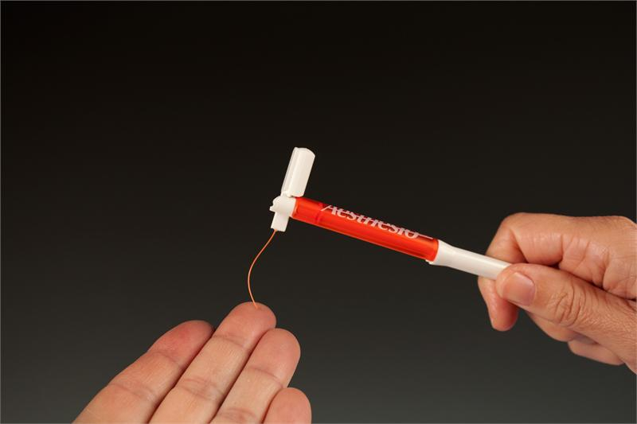
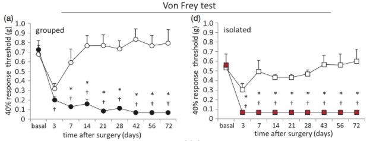

# Mechanical Assays

## Von Frey 

### Equipment

Von Frey Monofilaments (VFM) are calibrated nylon filaments that deliver a defined force when applied to a surface.

In recent years, electronic von Frey (eVF) apparatuses have emerged to improve on the traditional VFM assay. 

### General Procedure

- A VFM is applied to a part of the subject's body. In rodents, the plantar surface of the hindpaw is by far the most common testing region. 
- Force is applied to the VFM by the tester until the filament begins to bend, at which point, no more force is transferred to the testing surface. 
- The bent filament is held in place for 1-5s (variable among laboraties and testers) and then removed.
- In general, a brisk withdrawal of the paw is considered a "positive response". No withdrawal is a negative response. 
	- Other behavioral responses are sometimes considered and can be used to add additional information such as prolonged lifting, biting, and licking. [Up Down](#up-down)

#### Frequency Method

In the frequency method, a VFM is applied to a subject multiple times, usually 5-10 trials. The responses are evaluated as positive or negative, and the output measure is response frequency, which is usually expressed as a percentage. If an increasing series of VFMs is used, the paw withdrawal threshold can be estimated. 

Here, in [@Simonetti:2014cg], different VFMs were applied for 5 trials at each force. The frequency response percentage is then plotted. Note the total number of applications = 5 trials x 4 forces = 20. 

>To measure mechanical sensitivity, animals were placed on an
elevated wire grid and the plantar hindpaw was stimulated using von Frey monofilaments
(0.04 – 1.4g). Paw withdrawal responses to 5 applications of each filament were tested.
[@Simonetti:2014cg]

In this figure from [@Pitzer:2016el], the paw withdrawal threshold (PWT) was estimated using the frequency method. 

  

>All animals were acclimatized on four con- secutive days for 1.5 h to the behavioral compartments. The von Frey test was performed in the morning. Mechanical sensitivity was determined using graded von Frey filaments with bending forces of 0.07, 0.16, 0.4, 0.6, 1, and 1.4 g on the plantar surface of the hind- paws. For the SNI mice, the filaments were applied only within the sural nerve territory (lateral part of the hind paw). Filaments were applied with increasing forces, and each filament was tested five times with adequate resting periods between each application, and the number of withdrawals was recorded. Mechanical thresholds were defined as the minimum pressure required for eliciting a 40% withdrawal responses out of five stimulations and measured in grams (force application).

Note: The number of trials per animal is 6 forces x 5 stimulations = 30 stimulations per mouse. The relatively high number of applications using the frequency method is why it is less common than the 

#### Up-Down

In the "Up-Down" method, one begins in the middle of a series of VFMs. If the first stimulation does not elicit a response, then the tester moves up to the next VFM in the series and applies again. If a response is elicited, the tester steps down to the prior VFM.

So for example, begin with the #5 filament in a VFM kit (contains 20, usually). 

5# No response
6# No response
7# Response
6# No response
7# Response 

## Pin Prick

A sharp, pointed object, such as an insect pin or injection needle, is applied to a surface, usually the plantar hindpaw. The typical response is a brisk withdrawal of the stimulated area (e.g. paw withdrawal). Responses can also be accompanied by other nocifensive behaviors such as biting or licking. 

### From the Literature

[@Arcourt:2017jr]
 
- Uses an insect pin on a 1g VFM on the paw. Attaching the insect pin to the VFM controls the maximal force of the pin, but it does not control the rate of force. Still, it allow for consistency of max force.

[@Peirs:2015jm]

> Animals were first placed in a square Plexiglas chamber on top of a wire mesh table. Animals were acclimated to this testing arena for 1 hour on the day prior to testing and for an additional 30 minutes immediately before testing. A small insect pin (tip diameter = 0.03 mm) was applied with minimal pressure to the plantar surface of the left hind paw, taking care not to penetrate the skin. If the animal showed aversive behavior (lifting, shaking, licking of the paw) a positive response was recorded. A negative response was recorded if the animal showed no such reaction within 2 seconds of application. The application was repeated 10 times with a 5-minute interval between applications, and a percentage positive response determined for each animal.

## Brush Assay

[@Duan:2014gy]

## Randall-Selitto 

